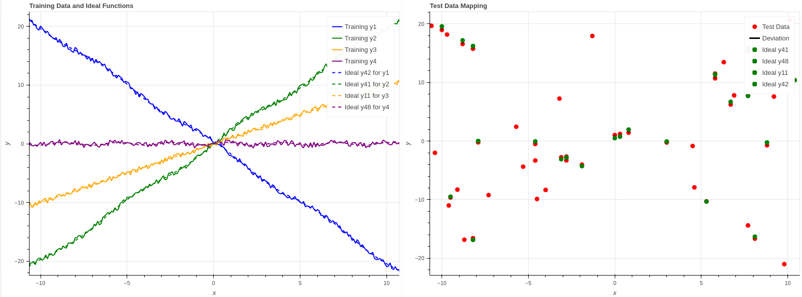

# Programming with Python Project

This my final project for the course DLMDSPWP01 (Programming with Python) at IU University's Master of Artificial Intelligence. It demonstrates the use of training datasets to match ideal functions, followed by mapping test data points to the selected ideal functions.

## Project Description

The objective of the project is to use a training data to select the best matching ideal functions from a set of 50 functions based on the least-squares method. Afterward, test data points are mapped to the selected ideal functions, with deviations recorded and visualized.

The project includes:
- **Data Handling** using `pandas` and `SQLAlchemy`.
- **Least-Squares Matching** for selecting the best ideal functions.
- **Test Data Mapping** based on deviation thresholds.
- **Visualization** using Bokeh to display the relationships between training data, ideal functions, and test data.
- **Unit Tests** to validate the functionality.

### Task Overview:

1. **Training Data and Ideal Function Matching**: 
   The program reads four training datasets (each representing a function) and matches them to the most appropriate ideal functions from a set of 50 functions by minimizing the sum of squared deviations (Least-Squares Method).

2. **Test Data Mapping**:
   Once the ideal functions are selected, the test dataset is processed. The program determines for each x-y pair of values in the test dataset whether it can be assigned to one of the four chosen ideal functions. If it can be assigned, the result is mapped and saved along with the corresponding deviation between the test value and the ideal function.

3. **Database Handling**:
   All datasets are loaded into an SQLite database. The following database structure is created:
   - **Training Data Table**: Contains x-values and the y-values of the four training functions.
   - **Ideal Functions Table**: Contains x-values and the y-values of the 50 ideal functions.
   - **Test Data Mapping Table**: Contains the x and y values of the test data, along with the mapped ideal function and the deviation.

4. **Data Visualization**:
   The program visualizes the training datasets, the selected ideal functions, the test data, and the corresponding deviations using Bokeh, a Python data visualization library.

5. **Exception Handling**:
   The program implements both standard and user-defined exception handling to ensure robustness and clear error reporting.

6. **Unit Testing**:
   Comprehensive unit tests are written for the major components of the project, including:
   - Database creation and data handling.
   - Least-squares function matching.
   - Test data mapping.

## Project Structure

```bash
.
├── datasets1
│   ├── ideal.csv       # Ideal functions dataset
│   ├── test.csv        # Test dataset
│   ├── train.csv       # Training datasets (4 training functions)
├── task_modules
│   ├── __init__.py
│   ├── data_handler.py     # Data handling for database interactions
│   ├── database_manager.py # Manages SQLite database operations
│   ├── least_squares_selector.py # Least-squares function matching logic
│   ├── test_data_mapper.py  # Logic for mapping test data to ideal functions
│   ├── visualize.py         # Visualization logic using Bokeh
├── EDA.ipynb            # Exploratory Data Analysis notebook
├── solution.ipynb # main file. Contains the solution of the problem
├── unit_tests.py        # Unit tests for all core functionalities
└── README.md            # Project readme (you're reading this file!)
```

## Installation & Setup

1. Clone the repository:
    ```bash
    git clone https://github.com/hualcosa/programming_with_python_DLMDSPWP01
    ```
2. Navigate into the project directory:
    ```bash
    cd programming_with_python_DLMDSPWP01
    ```

3. Install the required dependencies using `pip`:
    ```bash
    pip install -r requirements.txt ### add
    ```
4. Ensure your Python version is compatible (Python 3.10 or higher is recommended).

## Usage

### Running the solution

you can run the solution by running the notebook `solution.ipynb`

In this notebook, you will:
- Load the training, ideal, and test data.
- Run the least-squares selection process.
- Map test data to the ideal functions.
- Visualize the results.


### Running Unit Tests

The project includes unit tests for validating the functionality of each module. You can run the tests using the `unittest` framework.

To run the tests:

```bash
python -m unittest -v unit_tests.py
```

This will execute all the tests in `unit_tests.py` with detailed output.

### Visualization

The project includes visualization capabilities using Bokeh. When you run the `solution.ipynb`, interactive plots will be generated to show the following:
- The training datasets.
- The selected ideal functions.
- The mapped test data and the corresponding deviations.
  


## License

This project is licensed under the MIT License - see the [LICENSE](LICENSE) file for details.

## Contact

For any questions or suggestions, please contact:

- **Name**: Hugo Albuquerque Cosme da Silva
- **Email**: hugo.silva@iu-study.org